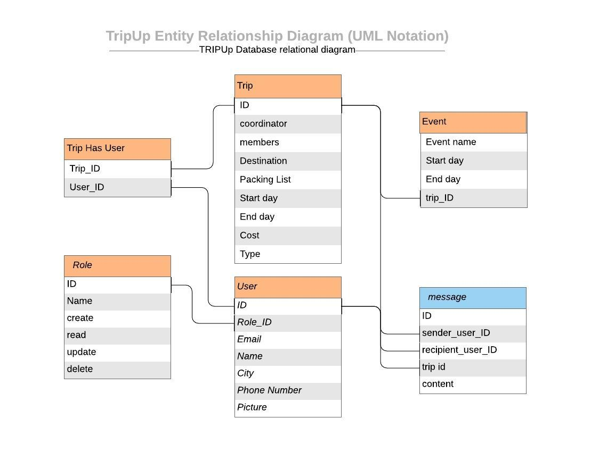

# Project Trip Up
##### An API to help you plan all your group trips!

### We Are Deployed On 
[Project URL here]()

### Web Application
Explanation of app

### Tools Used
* Express
* 

### Getting Started

* How to get the project started

### Usage

* Pictures of usage of the app
- 

### Data Flow
Image of data model goes here

### Authors
 Tyler Sayvetz, Cait Rowland, Kevin Dreyer, and Susanna Lakey

#### Resources
* [Trello Board](https://trello.com/b/7nNHZZws/tripup)
