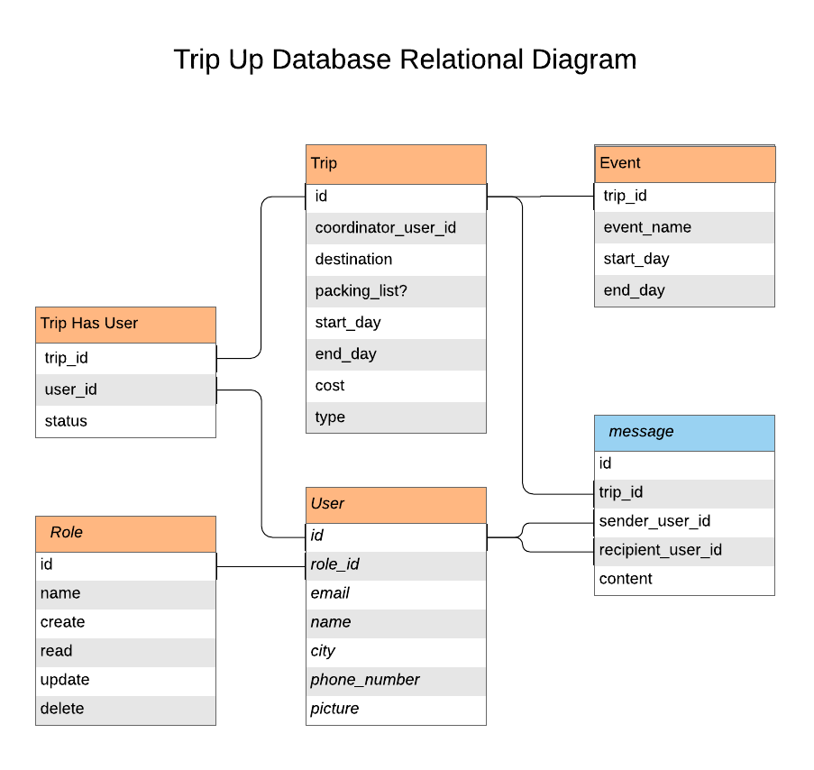

# Project Trip Up
##### An API to help you plan all your group trips!

### We Are Deployed On 
[https://trip-ups.herokuapp.com/](https://trip-ups.herokuapp.com/)

### Documentation
[Trip Up Api Docs](https://trip-up.github.io/trip-up/)

### What is Trip Up?
Trip Up is an API to help you plan your group trips.  Once a user has signed up, they have the option to create a new trip.  Once they've created a new trip, they become the coordinator of that trip, giving them the ability to create new events related to their trip.  Other users have the option to see all available trips within the API and can signup for a trip of their choice.  The coordinator of the trip they signup for has the ability to approve or deny their signup.

### Tools Used
* Express
* MySQL
* Sequelize
* JSON Web Tokens
* JSDoc

### Getting Started

* Install [mysql](https://www.mysql.com/downloads/)
* Install [httpie](https://httpie.org/) to interact with the API
* `npm i express, sequelize, jsonwebtoken, dotenv`
* run `node index.js`
* As a user you can: 
  * Signup: `$ http POST :3000/signup email=<email> name=<name> password=<password> city=<city> phone=<phone-number> picture=`
  * Signin: `$ http POST :3000/signin "username:password"`
  * Create Trip: `$ http POST :3000/trips name=<name-of-trip> destination=<destination-of-trip> start_day=<start-date> end_day=<end-date> cost=<numeric-value-of-cost> type=<type-of-trip>`
  * See a list of all trips available: `$ http GET :3000/trips`
  * Signup for Trip: `$  http POST :3000//trip-signups/<trip-id-here>   ....`
  * See a list of trips you have signed up for: `$`
* As a trip coordinator you can:
    * Approve/Deny users signing up to your trip: `$`
    * Add events to your trip: `$`
    * Update your events: `$`
    * Delete events on your trip: `$`
    * Delete the trip you created: `$`

### Usage
* Images of usage of the app

### Data Flow

#### DB relational diagram

### Authors
 Tyler Sayvetz, Cait Rowland, Kevin Dreyer, and Susanna Lakey

#### Resources
* [Trello Board](https://trello.com/b/7nNHZZws/tripup)
* [Lucid Chart](https://www.lucidchart.com/pages/database-diagram/database-models)

