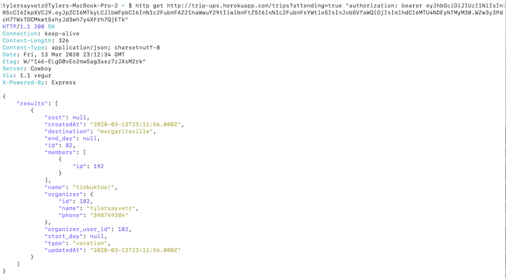

# Project Trip Up
##### An API to help you plan all your group trips!

### We Are Deployed On 
[https://trip-ups.herokuapp.com/](https://trip-ups.herokuapp.com/)

### What is Trip Up?
Trip Up is an API to help you plan your group trips.  Once a user has signed up, they have the option to create a new trip.  Once they've created a new trip, they become the coordinator of that trip, giving them the ability to create new events related to their trip.  Other users have the option to see all available trips within the API and can signup for a trip of their choice.  The coordinator of the trip they signup for has the ability to approve or deny their signup.

### Tools Used
* Express
* MySQL
* Sequelize
* JSON Web Tokens
* JSDoc
* Config
* Base-64
* Bcrypt
* Jest

### Getting Started

* Install [mysql](https://www.mysql.com/downloads/)
* Install [httpie](https://httpie.org/) to interact with the API
* `npm i` to install all dependencies.
* run `node index.js` to start server and connect to database
* Create a .env with PORT, DB_PASSWORD, SECRET, and DEFAULTROLE=2

### Usage
* As a user you can: 
  * Signup: 
      * Input: `$ http POST :3000/signup email=<email> name=<name> password=<password> city=<city> phone=<phone-number> picture=`
      * Output: Token

      

  * Signin: 
      * Input: `$ http -a email:password POST :3000/signin`
      * Output: New Token

      

  * Create a Trip: 
      * Input: `$ http POST :3000/trips "Authorization: Bearer <token>" name=<name-of-trip> destination=<destination-of-trip> start_day=<start-date> end_day=<end-date> cost=<numeric-value-of-cost> type=<type-of-trip>`
      * Output: New trip added to trip database

      

  * See a list of all trips available: 
      * Input: `$ http GET :3000/trips "Authorization: Bearer <token>`
      * Output: A list of all trips available to signup for

      

  * Signup for Trip: 
      * Input: `$  http POST :3000/trip-signups/<trip_id> user_id=<user_id>`
      * Output: `Trip sign-up pending approval`

      
`
  * See a list of trips you have signed up for: 
      * Input: `$ http GET :3000/trips?attending=true "Authorization: Bearer <token>`
      * Output: List of trips signed up and approved for

      

* As a trip organizer you can:

    * View a list of pending trip signups:
        * Input: `$ http GET :3000/trip-signups trip_id=<trip_id> organizer_user_id=<user_id_of_organizer>`
        * Output: List of all users pending singup to the organizers trip

        

    * Approve/Deny users signing up to your trip: 
        * Input: `$ http PUT :3000/trip-signups/<trip_id> organizer_user_id=<organizer_user_id> user_id=<user_id> approval=<boolean_value>`
        * Output: `"Signup Approved!"`

        

    * Update your trip details:
        * Input: `$ http put :3000/trips/<trip id> <trip fields> "Authorization: Bearer <token>"`
        * Output: Event details updated

    * Add events to your trip: 
        * Input: `$ http POST :3000/events/<trip-id> organizer_user_id=<id> name=<name> start_day=<day> end_day=<day>`
        * Output: Event added to event database

        
    * Update your events: 
        * Input: `$ http PUT :3000/events/<event_id> organizer_user_id=<organizer_user_id> name=<name-updating-to>`
        * Output: Updates name of event

    * Delete events on your trip: 
        * Input: `$ http delete :3000/events/<event_id> organizer_user_id=<organizer_user_id>`
        * Output: Event deleted from database

    * Delete the trip you created: 
        * Input: `$ http delete :3000/trips/<trip id> "Authorization: Bearer <token>"`
        * Output: Trip deleted from database

        

* As an Admin you can:
    * See a list of all trips with all user details:
      * Input: `$ http GET :3000/trips "Authorization: Bearer <admin-token>`
      * Output: List of details on all trips and all users signed up for trips

      

### Data Flow

#### DB relational diagram

### Authors
 Tyler Sayvetz, Cait Rowland, Kevin Dreyer, and Susanna Lakey

#### Resources
* [Trello Board](https://trello.com/b/7nNHZZws/tripup)
* [Lucid Chart](https://www.lucidchart.com/pages/database-diagram/database-models)

